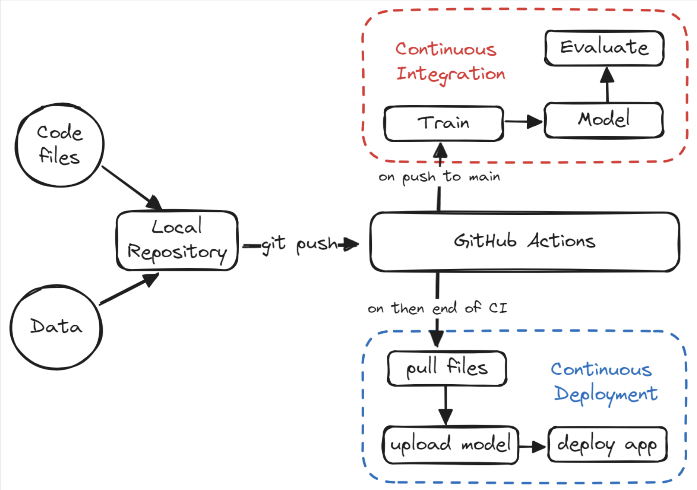

# Drug Classification App

## Description

The project uses scikit-learn pipelines to train a random forest classifier and build a drug classifier. After training, it automates the evaluation process using Continuous Machine Learning (CML). Finally, it builds and deploys the web application to Hugging Face Hub.

From training to evaluation, the entire process is automated using GitHub actions. Once the code changes are pushed to the repository, a CI/CD pipeline is triggered which trains and evaluates the model and finally, pushes the app to HuggingFace Spaces for deployment. 

## URL to HuggingFace Spaces

https://huggingface.co/spaces/amitca75/Drug-Classification

## Architecture

## Libraries Used

* scikit-learn
* numpy
* pandas
* matplotlib
* skops
* black
* gradio